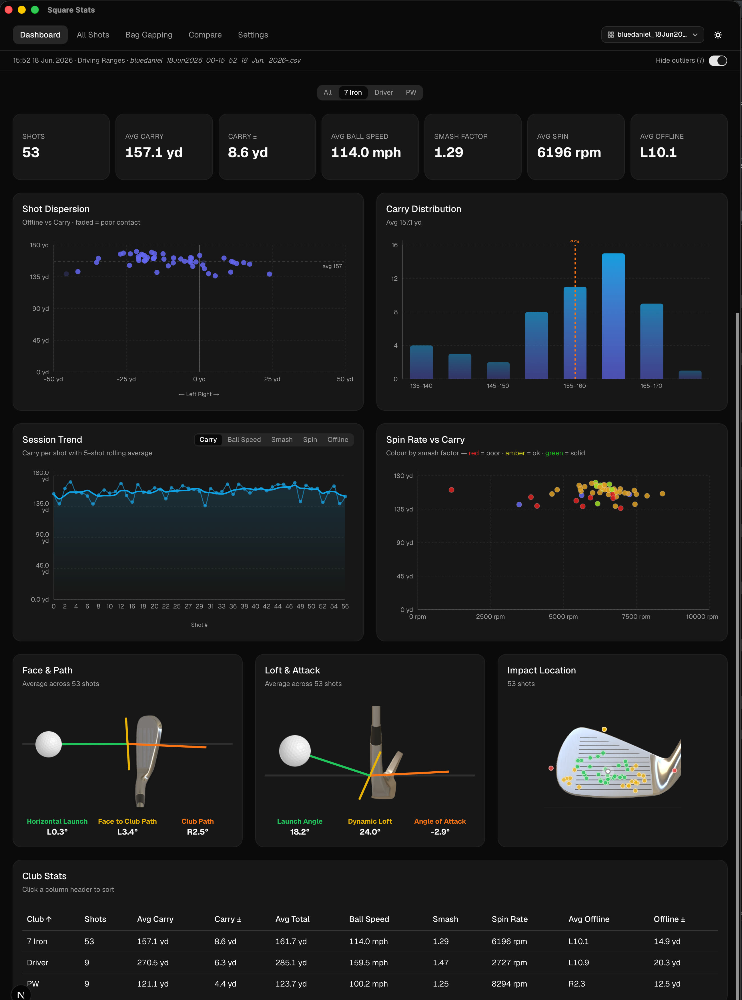
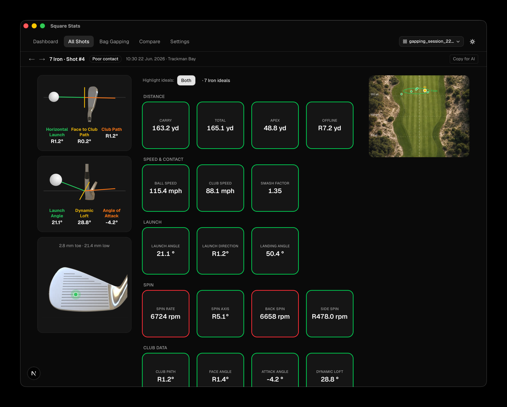
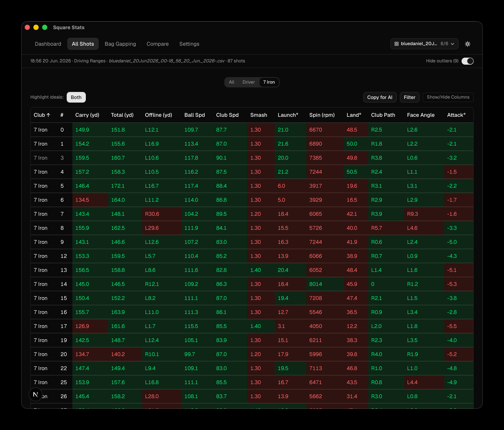
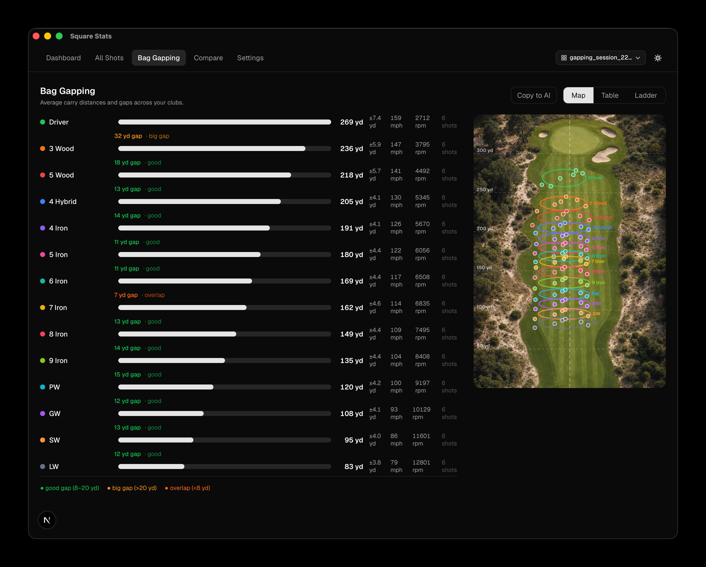
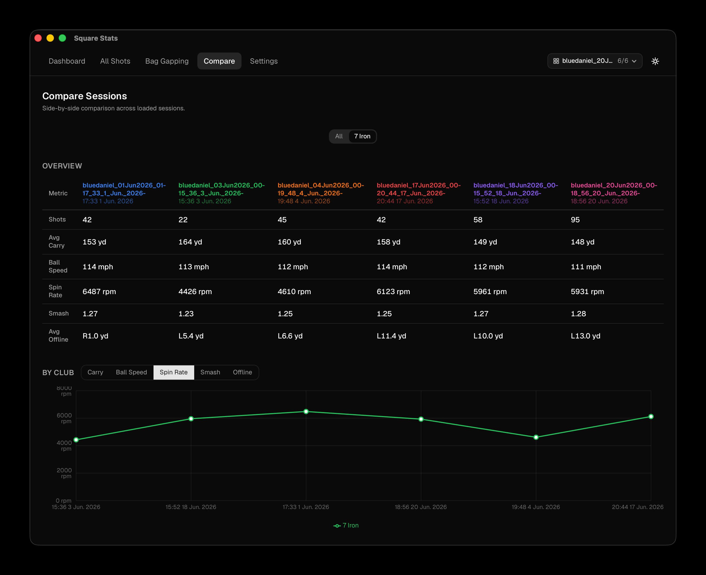

# Square Stats

A local desktop app for analysing Square launch monitor sessions. Drop in one or more CSV exports and get shot dispersion, distance histograms, spin charts, trend lines, a per-shot breakdown with club face diagrams, bag gapping, and cross-session comparison — all offline, no account required.

**[Download the latest release](https://github.com/bluedaniel/square-stats/releases/)** — macOS and Windows.

## Screenshots



<table>
  <tr>
    <td align="center"><br/><sub>Shot detail</sub></td>
    <td align="center"><br/><sub>All shots</sub></td>
  </tr>
  <tr>
    <td align="center"><br/><sub>Bag gapping</sub></td>
    <td align="center"><br/><sub>Compare sessions</sub></td>
  </tr>
</table>

## What it does

- **Session dashboard** — overview of dispersion, carry distribution, ball speed trend, and smash/spin scatter for any club or the full session
- **All shots table** — filterable, sortable shot log with outlier detection and poor-contact flagging
- **Shot detail** — per-shot stats (distance, speed, launch, spin, club data) with face-to-path diagram, loft diagram, and impact location overlay
- **Bag gapping** — distance ladder across your bag: progress bars, sortable stats table, and a horizontal carry ladder with ±1 std dev capsules showing consistency per club; overlaid on a top-down fairway photo with yardage markers and per-shot scatter
- **Session compare** — load multiple CSVs and compare them side-by-side: overview metrics table, per-club line chart (carry, ball speed, spin, smash, offline) with session dates on the X axis, and a delta table showing signed changes between two sessions
- **Club ideals** — set ideal ranges per club; stats highlight green/amber/red against your benchmarks
- **Dark mode** — full light/dark theme

## Running it

**Dev (live reload):**
```bash
npm run tauri dev
```

**Build distributable `.app`:**
```bash
npm run tauri build
# → src-tauri/target/release/bundle/macos/
```

Requires [Rust](https://rustup.rs) installed.

## CSV format

Accepts Square launch monitor exports. Drop the `.csv` file onto the landing screen or use the Load button. The app reads session metadata (date, location) from the header rows and skips `Average`/`Deviation` summary rows automatically.

## Stack

- [Tauri v2](https://tauri.app) — native shell, no Electron
- [Next.js](https://nextjs.org) — static export frontend
- [Recharts](https://recharts.org) — charts
- [shadcn/ui](https://ui.shadcn.com) — UI components
